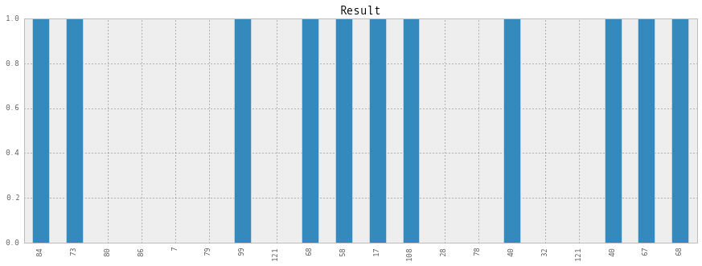
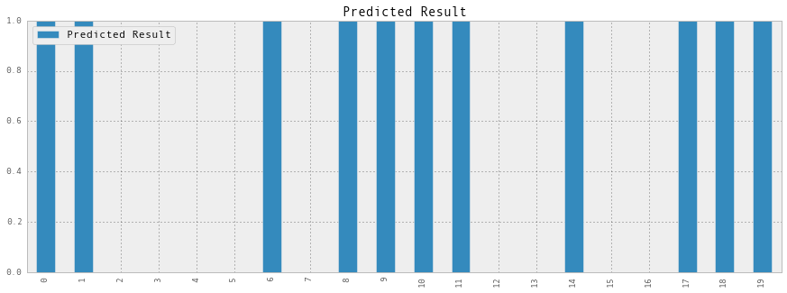
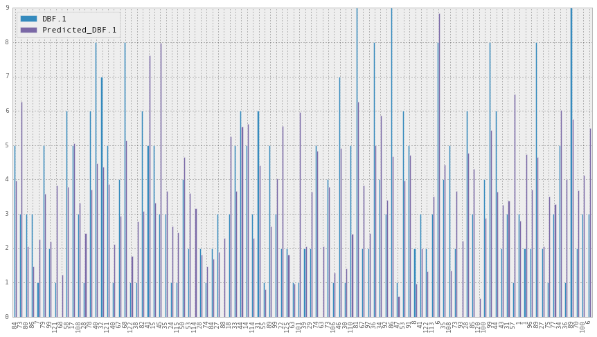
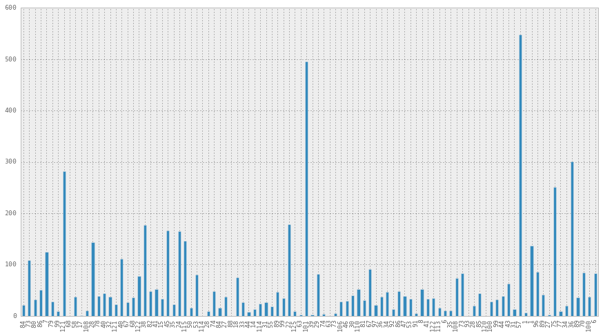

# This procedure does some machine learning tasks on the UCI Tennis data. The data is stored in the form of CSV files in current folder. We will use python to implement machine learning.


```python
#Lets load os module to fine the files present in the directory
import os
```

Our csv files are in the data folder. So let's see the files first


```python
data_files_path = 'data/'
data_files = os.listdir(data_files_path)
```


```python
print data_files
```

    ['Wimbledon-women-2013.csv', 'FrenchOpen-women-2013.csv', 'AusOpen-men-2013.csv', 'FrenchOpen-men-2013.csv', 'Wimbledon-men-2013.csv', 'AusOpen-women-2013.csv', 'USOpen-women-2013.csv', 'USOpen-men-2013.csv']


Now lets load the data from the files. We will use pandas module to load the data.


```python
import pandas as pd
input_data = pd.read_csv(data_files_path + data_files[0]);
```

Now lets see how does the data looks. Lets see first 5 rows of the data.


```python
input_data[:5]
```


<div style="max-height:1000px;max-width:1500px;overflow:auto;">
<table border="1" class="dataframe">
  <thead>
    <tr style="text-align: right;">
      <th></th>
      <th>Player1</th>
      <th>Player2</th>
      <th>Round</th>
      <th>Result</th>
      <th>FNL.1</th>
      <th>FNL.2</th>
      <th>FSP.1</th>
      <th>FSW.1</th>
      <th>SSP.1</th>
      <th>SSW.1</th>
      <th>...</th>
      <th>BPC.2</th>
      <th>BPW.2</th>
      <th>NPA.2</th>
      <th>NPW.2</th>
      <th>TPW.2</th>
      <th>ST1.2</th>
      <th>ST2.2</th>
      <th>ST3.2</th>
      <th>ST4.2</th>
      <th>ST5.2</th>
    </tr>
  </thead>
  <tbody>
    <tr>
      <th>0</th>
      <td>    M.Koehler</td>
      <td> V.Azarenka</td>
      <td> 1</td>
      <td> 0</td>
      <td> 0</td>
      <td> 2</td>
      <td> 60</td>
      <td> 21</td>
      <td> 40</td>
      <td>  8</td>
      <td>...</td>
      <td> 16</td>
      <td> 6</td>
      <td>  8</td>
      <td>  4</td>
      <td>NaN</td>
      <td> 6</td>
      <td> 6</td>
      <td>NaN</td>
      <td>NaN</td>
      <td>NaN</td>
    </tr>
    <tr>
      <th>1</th>
      <td>   E.Baltacha</td>
      <td> F.Pennetta</td>
      <td> 1</td>
      <td> 0</td>
      <td> 0</td>
      <td> 2</td>
      <td> 69</td>
      <td> 23</td>
      <td> 31</td>
      <td>  6</td>
      <td>...</td>
      <td>  6</td>
      <td> 5</td>
      <td> 14</td>
      <td> 11</td>
      <td>NaN</td>
      <td> 6</td>
      <td> 6</td>
      <td>NaN</td>
      <td>NaN</td>
      <td>NaN</td>
    </tr>
    <tr>
      <th>2</th>
      <td>    S-W.Hsieh</td>
      <td>    T.Maria</td>
      <td> 1</td>
      <td> 1</td>
      <td> 2</td>
      <td> 0</td>
      <td> 63</td>
      <td> 17</td>
      <td> 37</td>
      <td> 10</td>
      <td>...</td>
      <td>  1</td>
      <td> 0</td>
      <td>  8</td>
      <td>  2</td>
      <td>NaN</td>
      <td> 1</td>
      <td> 0</td>
      <td>NaN</td>
      <td>NaN</td>
      <td>NaN</td>
    </tr>
    <tr>
      <th>3</th>
      <td>     A.Cornet</td>
      <td>     V.King</td>
      <td> 1</td>
      <td> 1</td>
      <td> 2</td>
      <td> 1</td>
      <td> 57</td>
      <td> 36</td>
      <td> 43</td>
      <td> 21</td>
      <td>...</td>
      <td>  4</td>
      <td> 1</td>
      <td> 48</td>
      <td> 32</td>
      <td>NaN</td>
      <td> 6</td>
      <td> 3</td>
      <td>  1</td>
      <td>NaN</td>
      <td>NaN</td>
    </tr>
    <tr>
      <th>4</th>
      <td> Y.Putintseva</td>
      <td> K.Flipkens</td>
      <td> 1</td>
      <td> 0</td>
      <td> 0</td>
      <td> 2</td>
      <td> 73</td>
      <td> 34</td>
      <td> 27</td>
      <td> 12</td>
      <td>...</td>
      <td>  9</td>
      <td> 3</td>
      <td> 35</td>
      <td> 24</td>
      <td>NaN</td>
      <td> 7</td>
      <td> 6</td>
      <td>NaN</td>
      <td>NaN</td>
      <td>NaN</td>
    </tr>
  </tbody>
</table>
<p>5 rows × 42 columns</p>
</div>


Lets see the Player1 column for first 5 rows


```python
input_data['Player1'][:5]
```


    0       M.Koehler
    1      E.Baltacha
    2       S-W.Hsieh
    3        A.Cornet
    4    Y.Putintseva
    Name: Player1, dtype: object


Now lets make a function to load data from all the data files. Since each file belongs to certain type of match/tournament. We will add additional column indiacting the file name or tournament type.


```python
def load_data(data_files):
    input_data = None;
    input_data_initialized = False; # to check the state of input_data variable
    for file_name in data_files:
        print 'Reading from file ' + file_name
        if not input_data_initialized:
            #Initialize the input_data
            data = pd.read_csv(data_files_path + file_name);
            input_data = data;
            input_data['Type'] = file_name.split('.')[0];
            input_data_initialized = True;
        else:
            #Store the data into data variable
            data = pd.read_csv(data_files_path + file_name);
            data['Type'] = file_name.split('.')[0];
            #Append the data into input_data
            input_data = input_data.append(data);
    return input_data;
```


```python
#Lets load data from all the files
input_data = load_data(data_files);
```

    Reading from file Wimbledon-women-2013.csv
    Reading from file FrenchOpen-women-2013.csv
    Reading from file AusOpen-men-2013.csv
    Reading from file FrenchOpen-men-2013.csv
    Reading from file Wimbledon-men-2013.csv
    Reading from file AusOpen-women-2013.csv
    Reading from file USOpen-women-2013.csv
    Reading from file USOpen-men-2013.csv


Lets check the size of data


```python
input_data.shape
```


    (943, 43)


This means the input_data have 943 rows and 42 columns

Lets see first 5 rows of input_data


```python
input_data[:5]
```


<div style="max-height:1000px;max-width:1500px;overflow:auto;">
<table border="1" class="dataframe">
  <thead>
    <tr style="text-align: right;">
      <th></th>
      <th>Player1</th>
      <th>Player2</th>
      <th>Round</th>
      <th>Result</th>
      <th>FNL.1</th>
      <th>FNL.2</th>
      <th>FSP.1</th>
      <th>FSW.1</th>
      <th>SSP.1</th>
      <th>SSW.1</th>
      <th>...</th>
      <th>BPW.2</th>
      <th>NPA.2</th>
      <th>NPW.2</th>
      <th>TPW.2</th>
      <th>ST1.2</th>
      <th>ST2.2</th>
      <th>ST3.2</th>
      <th>ST4.2</th>
      <th>ST5.2</th>
      <th>Type</th>
    </tr>
  </thead>
  <tbody>
    <tr>
      <th>0</th>
      <td>    M.Koehler</td>
      <td> V.Azarenka</td>
      <td> 1</td>
      <td> 0</td>
      <td> 0</td>
      <td> 2</td>
      <td> 60</td>
      <td> 21</td>
      <td> 40</td>
      <td>  8</td>
      <td>...</td>
      <td> 6</td>
      <td>  8</td>
      <td>  4</td>
      <td>NaN</td>
      <td> 6</td>
      <td> 6</td>
      <td>NaN</td>
      <td>NaN</td>
      <td>NaN</td>
      <td> Wimbledon-women-2013</td>
    </tr>
    <tr>
      <th>1</th>
      <td>   E.Baltacha</td>
      <td> F.Pennetta</td>
      <td> 1</td>
      <td> 0</td>
      <td> 0</td>
      <td> 2</td>
      <td> 69</td>
      <td> 23</td>
      <td> 31</td>
      <td>  6</td>
      <td>...</td>
      <td> 5</td>
      <td> 14</td>
      <td> 11</td>
      <td>NaN</td>
      <td> 6</td>
      <td> 6</td>
      <td>NaN</td>
      <td>NaN</td>
      <td>NaN</td>
      <td> Wimbledon-women-2013</td>
    </tr>
    <tr>
      <th>2</th>
      <td>    S-W.Hsieh</td>
      <td>    T.Maria</td>
      <td> 1</td>
      <td> 1</td>
      <td> 2</td>
      <td> 0</td>
      <td> 63</td>
      <td> 17</td>
      <td> 37</td>
      <td> 10</td>
      <td>...</td>
      <td> 0</td>
      <td>  8</td>
      <td>  2</td>
      <td>NaN</td>
      <td> 1</td>
      <td> 0</td>
      <td>NaN</td>
      <td>NaN</td>
      <td>NaN</td>
      <td> Wimbledon-women-2013</td>
    </tr>
    <tr>
      <th>3</th>
      <td>     A.Cornet</td>
      <td>     V.King</td>
      <td> 1</td>
      <td> 1</td>
      <td> 2</td>
      <td> 1</td>
      <td> 57</td>
      <td> 36</td>
      <td> 43</td>
      <td> 21</td>
      <td>...</td>
      <td> 1</td>
      <td> 48</td>
      <td> 32</td>
      <td>NaN</td>
      <td> 6</td>
      <td> 3</td>
      <td>  1</td>
      <td>NaN</td>
      <td>NaN</td>
      <td> Wimbledon-women-2013</td>
    </tr>
    <tr>
      <th>4</th>
      <td> Y.Putintseva</td>
      <td> K.Flipkens</td>
      <td> 1</td>
      <td> 0</td>
      <td> 0</td>
      <td> 2</td>
      <td> 73</td>
      <td> 34</td>
      <td> 27</td>
      <td> 12</td>
      <td>...</td>
      <td> 3</td>
      <td> 35</td>
      <td> 24</td>
      <td>NaN</td>
      <td> 7</td>
      <td> 6</td>
      <td>NaN</td>
      <td>NaN</td>
      <td>NaN</td>
      <td> Wimbledon-women-2013</td>
    </tr>
  </tbody>
</table>
<p>5 rows × 43 columns</p>
</div>


Lets read all the player names and match types


```python
player_names = input_data['Player1'].copy();
player_names = player_names.append(input_data['Player2']);

tournament_types = input_data['Type'].copy();
```


```python
player_names[:5]
```


    0       M.Koehler
    1      E.Baltacha
    2       S-W.Hsieh
    3        A.Cornet
    4    Y.Putintseva
    dtype: object


We need to divide the data into two parts. One to train the learning algorithms, and other part to test the algorithms. We will select 100 rows randomaly for test data.


```python
import numpy as np
#Lets randomize the rows in input_data
input_data = input_data.take(np.random.permutation(len(input_data))[:])
#Lets take first 100 rows now
test_data = input_data[:100].copy();
input_data = input_data[100:-1];
```

Test data looks like:


```python
test_data.shape
```


    (100, 43)


```python
input_data.shape
```


    (842, 43)


The Result column have results of all the matches. 
The result is 1 if Player1 won the match, it is zero if Player2 won the match. We will be feeding all this data to learning algorithm. The algorithm accepts numeric values only. So we need to convert the player names and match types into numeric values. We will be identifying each player with a unique number. To do so lets import preprocessing module of sklearn, and use the label encoder availabel in it.


```python
from sklearn import preprocessing
name_encoder = preprocessing.LabelEncoder()
tournament_encoder = preprocessing.LabelEncoder()
```

Now lets transform the names into numeric values


```python
names_fit = name_encoder.fit(player_names)
tournament_fit = tournament_encoder.fit(tournament_types)
input_data['Player1'] = names_fit.transform(input_data['Player1']);
input_data['Player2'] = names_fit.transform(input_data['Player2']);
input_data['Type'] = tournament_fit.transform(input_data['Type']);

test_data['Player1'] = names_fit.transform(test_data['Player1']);
test_data['Player2'] = names_fit.transform(test_data['Player2']);
test_data['Type'] = tournament_fit.transform(test_data['Type']);
```


```python
input_data[['Player1', 'Player2', 'Type']][:5]
```


<div style="max-height:1000px;max-width:1500px;overflow:auto;">
<table border="1" class="dataframe">
  <thead>
    <tr style="text-align: right;">
      <th></th>
      <th>Player1</th>
      <th>Player2</th>
      <th>Type</th>
    </tr>
  </thead>
  <tbody>
    <tr>
      <th>104</th>
      <td>  97</td>
      <td> 331</td>
      <td> 2</td>
    </tr>
    <tr>
      <th>24 </th>
      <td> 465</td>
      <td> 423</td>
      <td> 3</td>
    </tr>
    <tr>
      <th>52 </th>
      <td> 326</td>
      <td> 219</td>
      <td> 1</td>
    </tr>
    <tr>
      <th>17 </th>
      <td> 310</td>
      <td> 503</td>
      <td> 5</td>
    </tr>
    <tr>
      <th>64 </th>
      <td> 568</td>
      <td> 639</td>
      <td> 1</td>
    </tr>
  </tbody>
</table>
</div>


```python
test_data[['Player1', 'Player2', 'Type']][:5]
```


<div style="max-height:1000px;max-width:1500px;overflow:auto;">
<table border="1" class="dataframe">
  <thead>
    <tr style="text-align: right;">
      <th></th>
      <th>Player1</th>
      <th>Player2</th>
      <th>Type</th>
    </tr>
  </thead>
  <tbody>
    <tr>
      <th>94</th>
      <td> 276</td>
      <td> 217</td>
      <td> 0</td>
    </tr>
    <tr>
      <th>32</th>
      <td> 398</td>
      <td> 455</td>
      <td> 7</td>
    </tr>
    <tr>
      <th>46</th>
      <td> 590</td>
      <td> 393</td>
      <td> 7</td>
    </tr>
    <tr>
      <th>86</th>
      <td> 517</td>
      <td> 432</td>
      <td> 2</td>
    </tr>
    <tr>
      <th>85</th>
      <td> 583</td>
      <td> 442</td>
      <td> 0</td>
    </tr>
  </tbody>
</table>
</div>


And the input_data looks like:


```python
input_data[:5]
```


<div style="max-height:1000px;max-width:1500px;overflow:auto;">
<table border="1" class="dataframe">
  <thead>
    <tr style="text-align: right;">
      <th></th>
      <th>Player1</th>
      <th>Player2</th>
      <th>Round</th>
      <th>Result</th>
      <th>FNL.1</th>
      <th>FNL.2</th>
      <th>FSP.1</th>
      <th>FSW.1</th>
      <th>SSP.1</th>
      <th>SSW.1</th>
      <th>...</th>
      <th>BPW.2</th>
      <th>NPA.2</th>
      <th>NPW.2</th>
      <th>TPW.2</th>
      <th>ST1.2</th>
      <th>ST2.2</th>
      <th>ST3.2</th>
      <th>ST4.2</th>
      <th>ST5.2</th>
      <th>Type</th>
    </tr>
  </thead>
  <tbody>
    <tr>
      <th>104</th>
      <td>  97</td>
      <td> 331</td>
      <td> 3</td>
      <td> 0</td>
      <td> 1</td>
      <td> 3</td>
      <td> 43</td>
      <td> 40</td>
      <td> 57</td>
      <td> 36</td>
      <td>...</td>
      <td> 19</td>
      <td> 14</td>
      <td> 27</td>
      <td> 137</td>
      <td> 6</td>
      <td> 6</td>
      <td>  6</td>
      <td>  6</td>
      <td>NaN</td>
      <td> 2</td>
    </tr>
    <tr>
      <th>24 </th>
      <td> 465</td>
      <td> 423</td>
      <td> 1</td>
      <td> 0</td>
      <td> 0</td>
      <td> 2</td>
      <td> 69</td>
      <td> 15</td>
      <td> 31</td>
      <td>  4</td>
      <td>...</td>
      <td> 11</td>
      <td>  3</td>
      <td>  5</td>
      <td>  60</td>
      <td> 6</td>
      <td> 6</td>
      <td>NaN</td>
      <td>NaN</td>
      <td>NaN</td>
      <td> 3</td>
    </tr>
    <tr>
      <th>52 </th>
      <td> 326</td>
      <td> 219</td>
      <td> 1</td>
      <td> 0</td>
      <td> 1</td>
      <td> 2</td>
      <td> 64</td>
      <td> 27</td>
      <td> 36</td>
      <td> 12</td>
      <td>...</td>
      <td> 12</td>
      <td>  1</td>
      <td>  3</td>
      <td>  85</td>
      <td> 6</td>
      <td> 2</td>
      <td>  6</td>
      <td>NaN</td>
      <td>NaN</td>
      <td> 1</td>
    </tr>
    <tr>
      <th>17 </th>
      <td> 310</td>
      <td> 503</td>
      <td> 3</td>
      <td> 0</td>
      <td> 0</td>
      <td> 2</td>
      <td> 58</td>
      <td> 22</td>
      <td> 42</td>
      <td>  8</td>
      <td>...</td>
      <td>  5</td>
      <td> 17</td>
      <td> 12</td>
      <td> NaN</td>
      <td> 6</td>
      <td> 6</td>
      <td>NaN</td>
      <td>NaN</td>
      <td>NaN</td>
      <td> 5</td>
    </tr>
    <tr>
      <th>64 </th>
      <td> 568</td>
      <td> 639</td>
      <td> 2</td>
      <td> 1</td>
      <td> 2</td>
      <td> 0</td>
      <td> 66</td>
      <td> 28</td>
      <td> 34</td>
      <td>  8</td>
      <td>...</td>
      <td>  1</td>
      <td>  3</td>
      <td>  3</td>
      <td>  37</td>
      <td> 1</td>
      <td> 2</td>
      <td>NaN</td>
      <td>NaN</td>
      <td>NaN</td>
      <td> 1</td>
    </tr>
  </tbody>
</table>
<p>5 rows × 43 columns</p>
</div>


Now we see that some data points are 'NaN', which is not a numeric value. So we need to replace it with numeric values. We will replace NaN values with 0. To check which values are 'NaN' there is isnul function which returns True if the value is null.


```python
input_data.isnull()[:5]
```


<div style="max-height:1000px;max-width:1500px;overflow:auto;">
<table border="1" class="dataframe">
  <thead>
    <tr style="text-align: right;">
      <th></th>
      <th>Player1</th>
      <th>Player2</th>
      <th>Round</th>
      <th>Result</th>
      <th>FNL.1</th>
      <th>FNL.2</th>
      <th>FSP.1</th>
      <th>FSW.1</th>
      <th>SSP.1</th>
      <th>SSW.1</th>
      <th>...</th>
      <th>BPW.2</th>
      <th>NPA.2</th>
      <th>NPW.2</th>
      <th>TPW.2</th>
      <th>ST1.2</th>
      <th>ST2.2</th>
      <th>ST3.2</th>
      <th>ST4.2</th>
      <th>ST5.2</th>
      <th>Type</th>
    </tr>
  </thead>
  <tbody>
    <tr>
      <th>104</th>
      <td> False</td>
      <td> False</td>
      <td> False</td>
      <td> False</td>
      <td> False</td>
      <td> False</td>
      <td> False</td>
      <td> False</td>
      <td> False</td>
      <td> False</td>
      <td>...</td>
      <td> False</td>
      <td> False</td>
      <td> False</td>
      <td> False</td>
      <td> False</td>
      <td> False</td>
      <td> False</td>
      <td> False</td>
      <td> True</td>
      <td> False</td>
    </tr>
    <tr>
      <th>24 </th>
      <td> False</td>
      <td> False</td>
      <td> False</td>
      <td> False</td>
      <td> False</td>
      <td> False</td>
      <td> False</td>
      <td> False</td>
      <td> False</td>
      <td> False</td>
      <td>...</td>
      <td> False</td>
      <td> False</td>
      <td> False</td>
      <td> False</td>
      <td> False</td>
      <td> False</td>
      <td>  True</td>
      <td>  True</td>
      <td> True</td>
      <td> False</td>
    </tr>
    <tr>
      <th>52 </th>
      <td> False</td>
      <td> False</td>
      <td> False</td>
      <td> False</td>
      <td> False</td>
      <td> False</td>
      <td> False</td>
      <td> False</td>
      <td> False</td>
      <td> False</td>
      <td>...</td>
      <td> False</td>
      <td> False</td>
      <td> False</td>
      <td> False</td>
      <td> False</td>
      <td> False</td>
      <td> False</td>
      <td>  True</td>
      <td> True</td>
      <td> False</td>
    </tr>
    <tr>
      <th>17 </th>
      <td> False</td>
      <td> False</td>
      <td> False</td>
      <td> False</td>
      <td> False</td>
      <td> False</td>
      <td> False</td>
      <td> False</td>
      <td> False</td>
      <td> False</td>
      <td>...</td>
      <td> False</td>
      <td> False</td>
      <td> False</td>
      <td>  True</td>
      <td> False</td>
      <td> False</td>
      <td>  True</td>
      <td>  True</td>
      <td> True</td>
      <td> False</td>
    </tr>
    <tr>
      <th>64 </th>
      <td> False</td>
      <td> False</td>
      <td> False</td>
      <td> False</td>
      <td> False</td>
      <td> False</td>
      <td> False</td>
      <td> False</td>
      <td> False</td>
      <td> False</td>
      <td>...</td>
      <td> False</td>
      <td> False</td>
      <td> False</td>
      <td> False</td>
      <td> False</td>
      <td> False</td>
      <td>  True</td>
      <td>  True</td>
      <td> True</td>
      <td> False</td>
    </tr>
  </tbody>
</table>
<p>5 rows × 43 columns</p>
</div>


Lets replace all the null values with 0.


```python
input_data[input_data.isnull()] = 0
test_data[test_data.isnull()] = 0
```


```python
input_data[:5]
```


<div style="max-height:1000px;max-width:1500px;overflow:auto;">
<table border="1" class="dataframe">
  <thead>
    <tr style="text-align: right;">
      <th></th>
      <th>Player1</th>
      <th>Player2</th>
      <th>Round</th>
      <th>Result</th>
      <th>FNL.1</th>
      <th>FNL.2</th>
      <th>FSP.1</th>
      <th>FSW.1</th>
      <th>SSP.1</th>
      <th>SSW.1</th>
      <th>...</th>
      <th>BPW.2</th>
      <th>NPA.2</th>
      <th>NPW.2</th>
      <th>TPW.2</th>
      <th>ST1.2</th>
      <th>ST2.2</th>
      <th>ST3.2</th>
      <th>ST4.2</th>
      <th>ST5.2</th>
      <th>Type</th>
    </tr>
  </thead>
  <tbody>
    <tr>
      <th>104</th>
      <td>  97</td>
      <td> 331</td>
      <td> 3</td>
      <td> 0</td>
      <td> 1</td>
      <td> 3</td>
      <td> 43</td>
      <td> 40</td>
      <td> 57</td>
      <td> 36</td>
      <td>...</td>
      <td> 19</td>
      <td> 14</td>
      <td> 27</td>
      <td> 137</td>
      <td> 6</td>
      <td> 6</td>
      <td> 6</td>
      <td> 6</td>
      <td> 0</td>
      <td> 2</td>
    </tr>
    <tr>
      <th>24 </th>
      <td> 465</td>
      <td> 423</td>
      <td> 1</td>
      <td> 0</td>
      <td> 0</td>
      <td> 2</td>
      <td> 69</td>
      <td> 15</td>
      <td> 31</td>
      <td>  4</td>
      <td>...</td>
      <td> 11</td>
      <td>  3</td>
      <td>  5</td>
      <td>  60</td>
      <td> 6</td>
      <td> 6</td>
      <td> 0</td>
      <td> 0</td>
      <td> 0</td>
      <td> 3</td>
    </tr>
    <tr>
      <th>52 </th>
      <td> 326</td>
      <td> 219</td>
      <td> 1</td>
      <td> 0</td>
      <td> 1</td>
      <td> 2</td>
      <td> 64</td>
      <td> 27</td>
      <td> 36</td>
      <td> 12</td>
      <td>...</td>
      <td> 12</td>
      <td>  1</td>
      <td>  3</td>
      <td>  85</td>
      <td> 6</td>
      <td> 2</td>
      <td> 6</td>
      <td> 0</td>
      <td> 0</td>
      <td> 1</td>
    </tr>
    <tr>
      <th>17 </th>
      <td> 310</td>
      <td> 503</td>
      <td> 3</td>
      <td> 0</td>
      <td> 0</td>
      <td> 2</td>
      <td> 58</td>
      <td> 22</td>
      <td> 42</td>
      <td>  8</td>
      <td>...</td>
      <td>  5</td>
      <td> 17</td>
      <td> 12</td>
      <td>   0</td>
      <td> 6</td>
      <td> 6</td>
      <td> 0</td>
      <td> 0</td>
      <td> 0</td>
      <td> 5</td>
    </tr>
    <tr>
      <th>64 </th>
      <td> 568</td>
      <td> 639</td>
      <td> 2</td>
      <td> 1</td>
      <td> 2</td>
      <td> 0</td>
      <td> 66</td>
      <td> 28</td>
      <td> 34</td>
      <td>  8</td>
      <td>...</td>
      <td>  1</td>
      <td>  3</td>
      <td>  3</td>
      <td>  37</td>
      <td> 1</td>
      <td> 2</td>
      <td> 0</td>
      <td> 0</td>
      <td> 0</td>
      <td> 1</td>
    </tr>
  </tbody>
</table>
<p>5 rows × 43 columns</p>
</div>


```python
test_data[:5]
```


<div style="max-height:1000px;max-width:1500px;overflow:auto;">
<table border="1" class="dataframe">
  <thead>
    <tr style="text-align: right;">
      <th></th>
      <th>Player1</th>
      <th>Player2</th>
      <th>Round</th>
      <th>Result</th>
      <th>FNL.1</th>
      <th>FNL.2</th>
      <th>FSP.1</th>
      <th>FSW.1</th>
      <th>SSP.1</th>
      <th>SSW.1</th>
      <th>...</th>
      <th>BPW.2</th>
      <th>NPA.2</th>
      <th>NPW.2</th>
      <th>TPW.2</th>
      <th>ST1.2</th>
      <th>ST2.2</th>
      <th>ST3.2</th>
      <th>ST4.2</th>
      <th>ST5.2</th>
      <th>Type</th>
    </tr>
  </thead>
  <tbody>
    <tr>
      <th>94</th>
      <td> 276</td>
      <td> 217</td>
      <td> 2</td>
      <td> 0</td>
      <td> 0</td>
      <td> 3</td>
      <td> 58</td>
      <td> 48</td>
      <td> 42</td>
      <td> 23</td>
      <td>...</td>
      <td> 11</td>
      <td> 20</td>
      <td> 26</td>
      <td> 117</td>
      <td> 7</td>
      <td> 7</td>
      <td> 6</td>
      <td> 0</td>
      <td> 0</td>
      <td> 0</td>
    </tr>
    <tr>
      <th>32</th>
      <td> 398</td>
      <td> 455</td>
      <td> 1</td>
      <td> 0</td>
      <td> 0</td>
      <td> 2</td>
      <td> 50</td>
      <td> 11</td>
      <td> 50</td>
      <td> 11</td>
      <td>...</td>
      <td>  5</td>
      <td> 18</td>
      <td> 16</td>
      <td>   0</td>
      <td> 6</td>
      <td> 6</td>
      <td> 0</td>
      <td> 0</td>
      <td> 0</td>
      <td> 7</td>
    </tr>
    <tr>
      <th>46</th>
      <td> 590</td>
      <td> 393</td>
      <td> 1</td>
      <td> 0</td>
      <td> 1</td>
      <td> 2</td>
      <td> 51</td>
      <td> 25</td>
      <td> 49</td>
      <td> 15</td>
      <td>...</td>
      <td>  7</td>
      <td> 18</td>
      <td> 12</td>
      <td>   0</td>
      <td> 4</td>
      <td> 6</td>
      <td> 6</td>
      <td> 0</td>
      <td> 0</td>
      <td> 7</td>
    </tr>
    <tr>
      <th>86</th>
      <td> 517</td>
      <td> 432</td>
      <td> 2</td>
      <td> 1</td>
      <td> 3</td>
      <td> 1</td>
      <td> 74</td>
      <td> 55</td>
      <td> 26</td>
      <td> 10</td>
      <td>...</td>
      <td>  7</td>
      <td> 15</td>
      <td> 28</td>
      <td>  90</td>
      <td> 6</td>
      <td> 3</td>
      <td> 3</td>
      <td> 3</td>
      <td> 0</td>
      <td> 2</td>
    </tr>
    <tr>
      <th>85</th>
      <td> 583</td>
      <td> 442</td>
      <td> 2</td>
      <td> 1</td>
      <td> 3</td>
      <td> 1</td>
      <td> 58</td>
      <td> 56</td>
      <td> 42</td>
      <td> 30</td>
      <td>...</td>
      <td>  7</td>
      <td> 22</td>
      <td> 36</td>
      <td> 112</td>
      <td> 6</td>
      <td> 1</td>
      <td> 7</td>
      <td> 1</td>
      <td> 0</td>
      <td> 0</td>
    </tr>
  </tbody>
</table>
<p>5 rows × 43 columns</p>
</div>


# Now lets make our first prediction function: Say we want to predict the result of the matches. 
The match result is stored in 'Result' column of the input_data. The result is a discrete variable, 
i.e. it is either 1 or 0. So we will use Logistci regression. The sklearn library have linear_model module which proides
functions for Linear/Logistic regressions.


```python
from sklearn import linear_model
logistic_regr = linear_model.LogisticRegression()
```

We need to define input data and target data for the model. Out target data in this case will be data of the 'Result' column. And rest of the data will be input data. So lets seperate the input and target data.


```python
target_column = 'Result';
input_data_columns = [];
for column in input_data.keys():
    if column != target_column:
        input_data_columns.append(column);
```


```python
input_data_columns
```


    ['Player1',
     'Player2',
     'Round',
     'FNL.1',
     'FNL.2',
     'FSP.1',
     'FSW.1',
     'SSP.1',
     'SSW.1',
     'ACE.1',
     'DBF.1',
     'WNR.1',
     'UFE.1',
     'BPC.1',
     'BPW.1',
     'NPA.1',
     'NPW.1',
     'TPW.1',
     'ST1.1',
     'ST2.1',
     'ST3.1',
     'ST4.1',
     'ST5.1',
     'FSP.2',
     'FSW.2',
     'SSP.2',
     'SSW.2',
     'ACE.2',
     'DBF.2',
     'WNR.2',
     'UFE.2',
     'BPC.2',
     'BPW.2',
     'NPA.2',
     'NPW.2',
     'TPW.2',
     'ST1.2',
     'ST2.2',
     'ST3.2',
     'ST4.2',
     'ST5.2',
     'Type']


```python
data_x = input_data[input_data_columns];
data_y = input_data[target_column];
```

Lets train our classifier


```python
clf = logistic_regr.fit(data_x, data_y);
```

Now lets test this classifier on our test data


```python
test_data_x = test_data[input_data_columns];
predicted_result = clf.predict(test_data_x)
```


```python
predicted_result
```


    array([0, 0, 0, 1, 1, 1, 0, 0, 1, 1, 0, 0, 1, 1, 1, 1, 0, 1, 1, 1, 1, 1, 1,
           0, 0, 0, 0, 0, 1, 0, 1, 0, 1, 1, 1, 0, 1, 0, 1, 1, 0, 1, 1, 0, 1, 1,
           0, 0, 0, 0, 1, 0, 0, 0, 0, 0, 1, 0, 0, 0, 0, 1, 0, 1, 1, 0, 1, 1, 1,
           1, 0, 1, 1, 1, 0, 0, 0, 0, 0, 0, 1, 0, 1, 1, 1, 1, 0, 0, 1, 0, 0, 0,
           0, 1, 0, 0, 0, 1, 0, 0])


Now lets compare it with actual result of the matches.


```python
actual_result = test_data[target_column].values;
```

Lets make a function to compare the results


```python
def compare_data(predicted, actual):
    total_match = 0;
    total_mismatch = 0;
    for i in range(0, len(predicted)):
        if predicted[i] == actual[i]:
            total_match += 1;
        else:
            total_mismatch += 1;
    print 'Total tested: ' + str(total_match + total_mismatch);
    print 'Correct results: ' + str(total_match);
    print 'Incorrect results: ' + str(total_mismatch);
```


```python
compare_data(predicted_result, actual_result)
```

    Total tested: 100
    Correct results: 100
    Incorrect results: 0


Lets plot the data. We can use matplotlib module to plot the data


```python
%matplotlib inline
import matplotlib as plt
pd.set_option('display.mpl_style', 'default') # Make the graphs a bit prettier
```


```python
test_data['Result'][:20].plot(kind='bar', subplots=True, figsize=(15, 5))
```


    array([<matplotlib.axes._subplots.AxesSubplot object at 0x7f2c862ed850>], dtype=object)





To plot the predicted data we need to convert it into pandas data frame first.


```python
predicted_result = pd.DataFrame(predicted_result, columns=['Predicted Result']);
```


```python
predicted_result[:20].plot(kind='bar', subplots=True, figsize=(15, 5))
```


    array([<matplotlib.axes._subplots.AxesSubplot object at 0x7f2c37915090>], dtype=object)





We can see that both the graphs are exactly same.

# Now lets make another classifier which predicts how many Double Faults player one commits. 
The column which stores this data in input_data is 'DBF.1'. Since it is a continuous variable we will use linear 
regression this time. The target column will be 'DBF1' and rest of the columns will be input data for the classifier.


```python
target_column = 'DBF.1';
input_data_columns = [];
for column in input_data.keys():
    if column != target_column:
        input_data_columns.append(column);
```


```python
data_x = input_data[input_data_columns];
data_y = input_data[target_column];
```


```python
linear_regr = linear_model.LinearRegression()
```


```python
#Train the classifier
clf = linear_regr.fit(data_x, data_y);
```


```python
#Test data input
test_data_x = test_data[input_data_columns];

predicted_result = clf.predict(test_data_x)
```


```python
predicted_result
```


    array([ 4.6807754 ,  2.74814154,  5.7547152 ,  2.59835707,  3.5741537 ,
            4.61715699,  4.25682735,  2.50014081,  0.85882584,  2.03040124,
           -0.21647355,  3.89913808,  2.49302772,  1.96312777,  3.90008352,
            1.26450756,  1.87756698,  2.690476  ,  2.41177514,  3.7689064 ,
            4.61406108,  3.16796618,  6.84437681,  3.47613382,  6.74253787,
            2.99245833,  3.37776623,  4.49254527,  6.5125463 ,  3.61497829,
            3.4071823 ,  3.50450105,  1.47960735,  5.06754886,  2.01215479,
            3.61536968,  2.11816697,  3.65699522,  4.14249929,  3.87128127,
            6.22777656,  3.73790753,  4.3544958 ,  3.81993735,  3.33751151,
            5.12465966,  4.59656088,  3.83451933,  4.39090843,  4.27520305,
            3.0523599 ,  3.31472356,  8.30825087,  3.67689785,  2.13132765,
            5.46061115,  3.97163359,  3.92543485,  6.05249292,  6.00850435,
            7.88229405,  2.43907427,  3.24320171,  0.95616103,  2.12885613,
            4.67518323,  1.67323009,  3.63011277,  5.41522562,  1.50312295,
            3.65764186,  2.04494725,  5.66455606,  2.06461613,  4.00841896,
            3.35960579,  4.20148863,  3.17091908,  3.710936  ,  4.33146103,
            1.17835677,  6.34855825,  3.40262899,  6.12896949,  0.91391578,
            4.16800863,  6.90233797,  1.69958487,  0.64659609,  6.35369965,
            1.70723291,  2.72202733,  3.30036586,  2.0154789 ,  2.28933499,
            5.32890407,  4.08366837,  4.85606478,  2.16974007,  5.9723021 ])


```python
test_data['Predicted_DBF.1'] = predicted_result
```


```python
#Lets check the actual result versus predicted result
test_data[['DBF.1', 'Predicted_DBF.1']]
```


<div style="max-height:1000px;max-width:1500px;overflow:auto;">
<table border="1" class="dataframe">
  <thead>
    <tr style="text-align: right;">
      <th></th>
      <th>DBF.1</th>
      <th>Predicted_DBF.1</th>
    </tr>
  </thead>
  <tbody>
    <tr>
      <th>94 </th>
      <td>  9</td>
      <td> 4.680775</td>
    </tr>
    <tr>
      <th>32 </th>
      <td>  2</td>
      <td> 2.748142</td>
    </tr>
    <tr>
      <th>46 </th>
      <td>  8</td>
      <td> 5.754715</td>
    </tr>
    <tr>
      <th>86 </th>
      <td>  2</td>
      <td> 2.598357</td>
    </tr>
    <tr>
      <th>85 </th>
      <td>  8</td>
      <td> 3.574154</td>
    </tr>
    <tr>
      <th>33 </th>
      <td>  3</td>
      <td> 4.617157</td>
    </tr>
    <tr>
      <th>93 </th>
      <td>  2</td>
      <td> 4.256827</td>
    </tr>
    <tr>
      <th>12 </th>
      <td>  4</td>
      <td> 2.500141</td>
    </tr>
    <tr>
      <th>104</th>
      <td>  2</td>
      <td> 0.858826</td>
    </tr>
    <tr>
      <th>40 </th>
      <td>  1</td>
      <td> 2.030401</td>
    </tr>
    <tr>
      <th>61 </th>
      <td>  1</td>
      <td>-0.216474</td>
    </tr>
    <tr>
      <th>15 </th>
      <td>  5</td>
      <td> 3.899138</td>
    </tr>
    <tr>
      <th>39 </th>
      <td>  1</td>
      <td> 2.493028</td>
    </tr>
    <tr>
      <th>125</th>
      <td>  2</td>
      <td> 1.963128</td>
    </tr>
    <tr>
      <th>29 </th>
      <td>  5</td>
      <td> 3.900084</td>
    </tr>
    <tr>
      <th>31 </th>
      <td>  0</td>
      <td> 1.264508</td>
    </tr>
    <tr>
      <th>26 </th>
      <td>  3</td>
      <td> 1.877567</td>
    </tr>
    <tr>
      <th>59 </th>
      <td>  5</td>
      <td> 2.690476</td>
    </tr>
    <tr>
      <th>2  </th>
      <td>  1</td>
      <td> 2.411775</td>
    </tr>
    <tr>
      <th>52 </th>
      <td>  2</td>
      <td> 3.768906</td>
    </tr>
    <tr>
      <th>1  </th>
      <td>  2</td>
      <td> 4.614061</td>
    </tr>
    <tr>
      <th>118</th>
      <td>  1</td>
      <td> 3.167966</td>
    </tr>
    <tr>
      <th>66 </th>
      <td> 10</td>
      <td> 6.844377</td>
    </tr>
    <tr>
      <th>94 </th>
      <td>  4</td>
      <td> 3.476134</td>
    </tr>
    <tr>
      <th>72 </th>
      <td>  4</td>
      <td> 6.742538</td>
    </tr>
    <tr>
      <th>34 </th>
      <td>  1</td>
      <td> 2.992458</td>
    </tr>
    <tr>
      <th>67 </th>
      <td>  4</td>
      <td> 3.377766</td>
    </tr>
    <tr>
      <th>20 </th>
      <td>  7</td>
      <td> 4.492545</td>
    </tr>
    <tr>
      <th>20 </th>
      <td>  5</td>
      <td> 6.512546</td>
    </tr>
    <tr>
      <th>71 </th>
      <td>  1</td>
      <td> 3.614978</td>
    </tr>
    <tr>
      <th>...</th>
      <td>...</td>
      <td>...</td>
    </tr>
    <tr>
      <th>8  </th>
      <td>  0</td>
      <td> 3.657642</td>
    </tr>
    <tr>
      <th>96 </th>
      <td>  5</td>
      <td> 2.044947</td>
    </tr>
    <tr>
      <th>6  </th>
      <td>  3</td>
      <td> 5.664556</td>
    </tr>
    <tr>
      <th>121</th>
      <td>  0</td>
      <td> 2.064616</td>
    </tr>
    <tr>
      <th>80 </th>
      <td>  0</td>
      <td> 4.008419</td>
    </tr>
    <tr>
      <th>44 </th>
      <td>  6</td>
      <td> 3.359606</td>
    </tr>
    <tr>
      <th>3  </th>
      <td>  6</td>
      <td> 4.201489</td>
    </tr>
    <tr>
      <th>4  </th>
      <td>  4</td>
      <td> 3.170919</td>
    </tr>
    <tr>
      <th>16 </th>
      <td>  4</td>
      <td> 3.710936</td>
    </tr>
    <tr>
      <th>1  </th>
      <td>  4</td>
      <td> 4.331461</td>
    </tr>
    <tr>
      <th>119</th>
      <td>  1</td>
      <td> 1.178357</td>
    </tr>
    <tr>
      <th>107</th>
      <td>  9</td>
      <td> 6.348558</td>
    </tr>
    <tr>
      <th>86 </th>
      <td>  5</td>
      <td> 3.402629</td>
    </tr>
    <tr>
      <th>73 </th>
      <td>  3</td>
      <td> 6.128969</td>
    </tr>
    <tr>
      <th>55 </th>
      <td>  1</td>
      <td> 0.913916</td>
    </tr>
    <tr>
      <th>33 </th>
      <td>  4</td>
      <td> 4.168009</td>
    </tr>
    <tr>
      <th>16 </th>
      <td> 14</td>
      <td> 6.902338</td>
    </tr>
    <tr>
      <th>124</th>
      <td>  0</td>
      <td> 1.699585</td>
    </tr>
    <tr>
      <th>90 </th>
      <td>  0</td>
      <td> 0.646596</td>
    </tr>
    <tr>
      <th>107</th>
      <td>  3</td>
      <td> 6.353700</td>
    </tr>
    <tr>
      <th>39 </th>
      <td>  3</td>
      <td> 1.707233</td>
    </tr>
    <tr>
      <th>119</th>
      <td>  0</td>
      <td> 2.722027</td>
    </tr>
    <tr>
      <th>105</th>
      <td>  3</td>
      <td> 3.300366</td>
    </tr>
    <tr>
      <th>102</th>
      <td>  1</td>
      <td> 2.015479</td>
    </tr>
    <tr>
      <th>14 </th>
      <td>  2</td>
      <td> 2.289335</td>
    </tr>
    <tr>
      <th>113</th>
      <td>  3</td>
      <td> 5.328904</td>
    </tr>
    <tr>
      <th>124</th>
      <td>  2</td>
      <td> 4.083668</td>
    </tr>
    <tr>
      <th>7  </th>
      <td>  4</td>
      <td> 4.856065</td>
    </tr>
    <tr>
      <th>88 </th>
      <td>  2</td>
      <td> 2.169740</td>
    </tr>
    <tr>
      <th>95 </th>
      <td>  6</td>
      <td> 5.972302</td>
    </tr>
  </tbody>
</table>
<p>100 rows × 2 columns</p>
</div>


```python
test_data[['DBF.1', 'Predicted_DBF.1']].plot(kind='bar', figsize=(15, 8))
```


    <matplotlib.axes._subplots.AxesSubplot at 0x7f2c32dd1310>





```python
test_data['Prediction_error'] = abs(test_data['DBF.1'] - test_data['Predicted_DBF.1'])*100/test_data['DBF.1']
```


```python
test_data['Prediction_error'].plot(kind='bar', figsize=(15, 8));
```





# Lets now predict the tournament name to which a game belongs to:

The data related to tournament name is in column 'Type'. We will predict it with Logistic regression, support vector machine and random forestal gorithms and will compare the results.


```python
#Our target column is 'Type'
target_column = 'Type';
input_data_columns = [];
for column in input_data.keys():
    if column != target_column:
        input_data_columns.append(column);
```

Based on the target column, lets get data_x, and data_y to train the classifier


```python
data_x = input_data[input_data_columns];
data_y = input_data[target_column];
```


```python
from sklearn import svm
from sklearn.ensemble import RandomForestClassifier
#logistic regression classifier
logistic_clf = linear_model.LogisticRegression();
#Linear SVC classifier
svm_clf = svm.LinearSVC();
#Random forest classifier
forest_clf = RandomForestClassifier(n_estimators=30)
```

Lets train all the different classifiers now


```python
logistic_clf.fit(data_x, data_y);

svm_clf.fit(data_x, data_y);

forest_clf.fit(data_x, data_y);
```


```python
#Test data input
test_data_x = test_data[input_data_columns];
test_data_y = test_data[target_column];
```

Lets predict results for each classifier now


```python
logistic_predicted_results = logistic_clf.predict(test_data_x);
svm_predicted_results = svm_clf.predict(test_data_x);
forest_predicted_results = forest_clf.predict(test_data_x);
```

Lets put all the results in a single data frame for easy comparision


```python
results = pd.DataFrame({'Actual_Type': test_data_y.values,
                        'Logistic_Predicted_Type': logistic_predicted_results,
                        'Svm_Predicted_Type': svm_predicted_results,
                        'Forest_predicted_Type': forest_predicted_results})
```


```python
#Lets see the predicted results versus actual result
results
```


<div style="max-height:1000px;max-width:1500px;overflow:auto;">
<table border="1" class="dataframe">
  <thead>
    <tr style="text-align: right;">
      <th></th>
      <th>Actual_Type</th>
      <th>Forest_predicted_Type</th>
      <th>Logistic_Predicted_Type</th>
      <th>Svm_Predicted_Type</th>
    </tr>
  </thead>
  <tbody>
    <tr>
      <th>0 </th>
      <td> 0</td>
      <td> 0</td>
      <td> 0</td>
      <td> 0</td>
    </tr>
    <tr>
      <th>1 </th>
      <td> 7</td>
      <td> 7</td>
      <td> 7</td>
      <td> 7</td>
    </tr>
    <tr>
      <th>2 </th>
      <td> 7</td>
      <td> 5</td>
      <td> 5</td>
      <td> 7</td>
    </tr>
    <tr>
      <th>3 </th>
      <td> 2</td>
      <td> 2</td>
      <td> 2</td>
      <td> 0</td>
    </tr>
    <tr>
      <th>4 </th>
      <td> 0</td>
      <td> 0</td>
      <td> 0</td>
      <td> 0</td>
    </tr>
    <tr>
      <th>5 </th>
      <td> 4</td>
      <td> 4</td>
      <td> 4</td>
      <td> 0</td>
    </tr>
    <tr>
      <th>6 </th>
      <td> 1</td>
      <td> 3</td>
      <td> 1</td>
      <td> 1</td>
    </tr>
    <tr>
      <th>7 </th>
      <td> 0</td>
      <td> 0</td>
      <td> 0</td>
      <td> 0</td>
    </tr>
    <tr>
      <th>8 </th>
      <td> 4</td>
      <td> 4</td>
      <td> 4</td>
      <td> 4</td>
    </tr>
    <tr>
      <th>9 </th>
      <td> 5</td>
      <td> 7</td>
      <td> 7</td>
      <td> 7</td>
    </tr>
    <tr>
      <th>10</th>
      <td> 3</td>
      <td> 3</td>
      <td> 3</td>
      <td> 0</td>
    </tr>
    <tr>
      <th>11</th>
      <td> 5</td>
      <td> 5</td>
      <td> 5</td>
      <td> 7</td>
    </tr>
    <tr>
      <th>12</th>
      <td> 0</td>
      <td> 2</td>
      <td> 0</td>
      <td> 0</td>
    </tr>
    <tr>
      <th>13</th>
      <td> 1</td>
      <td> 3</td>
      <td> 1</td>
      <td> 1</td>
    </tr>
    <tr>
      <th>14</th>
      <td> 1</td>
      <td> 1</td>
      <td> 1</td>
      <td> 1</td>
    </tr>
    <tr>
      <th>15</th>
      <td> 0</td>
      <td> 0</td>
      <td> 2</td>
      <td> 0</td>
    </tr>
    <tr>
      <th>16</th>
      <td> 7</td>
      <td> 7</td>
      <td> 7</td>
      <td> 7</td>
    </tr>
    <tr>
      <th>17</th>
      <td> 1</td>
      <td> 1</td>
      <td> 3</td>
      <td> 0</td>
    </tr>
    <tr>
      <th>18</th>
      <td> 5</td>
      <td> 5</td>
      <td> 5</td>
      <td> 7</td>
    </tr>
    <tr>
      <th>19</th>
      <td> 6</td>
      <td> 6</td>
      <td> 6</td>
      <td> 6</td>
    </tr>
    <tr>
      <th>20</th>
      <td> 4</td>
      <td> 4</td>
      <td> 4</td>
      <td> 4</td>
    </tr>
    <tr>
      <th>21</th>
      <td> 3</td>
      <td> 3</td>
      <td> 3</td>
      <td> 0</td>
    </tr>
    <tr>
      <th>22</th>
      <td> 4</td>
      <td> 4</td>
      <td> 4</td>
      <td> 4</td>
    </tr>
    <tr>
      <th>23</th>
      <td> 7</td>
      <td> 7</td>
      <td> 7</td>
      <td> 7</td>
    </tr>
    <tr>
      <th>24</th>
      <td> 5</td>
      <td> 5</td>
      <td> 5</td>
      <td> 5</td>
    </tr>
    <tr>
      <th>25</th>
      <td> 2</td>
      <td> 0</td>
      <td> 2</td>
      <td> 0</td>
    </tr>
    <tr>
      <th>26</th>
      <td> 2</td>
      <td> 0</td>
      <td> 0</td>
      <td> 0</td>
    </tr>
    <tr>
      <th>27</th>
      <td> 3</td>
      <td> 3</td>
      <td> 1</td>
      <td> 0</td>
    </tr>
    <tr>
      <th>28</th>
      <td> 4</td>
      <td> 4</td>
      <td> 4</td>
      <td> 4</td>
    </tr>
    <tr>
      <th>29</th>
      <td> 2</td>
      <td> 2</td>
      <td> 2</td>
      <td> 0</td>
    </tr>
    <tr>
      <th>...</th>
      <td>...</td>
      <td>...</td>
      <td>...</td>
      <td>...</td>
    </tr>
    <tr>
      <th>70</th>
      <td> 0</td>
      <td> 2</td>
      <td> 0</td>
      <td> 0</td>
    </tr>
    <tr>
      <th>71</th>
      <td> 7</td>
      <td> 7</td>
      <td> 7</td>
      <td> 7</td>
    </tr>
    <tr>
      <th>72</th>
      <td> 6</td>
      <td> 6</td>
      <td> 6</td>
      <td> 6</td>
    </tr>
    <tr>
      <th>73</th>
      <td> 2</td>
      <td> 2</td>
      <td> 2</td>
      <td> 0</td>
    </tr>
    <tr>
      <th>74</th>
      <td> 2</td>
      <td> 0</td>
      <td> 2</td>
      <td> 0</td>
    </tr>
    <tr>
      <th>75</th>
      <td> 6</td>
      <td> 6</td>
      <td> 6</td>
      <td> 7</td>
    </tr>
    <tr>
      <th>76</th>
      <td> 3</td>
      <td> 1</td>
      <td> 3</td>
      <td> 1</td>
    </tr>
    <tr>
      <th>77</th>
      <td> 2</td>
      <td> 0</td>
      <td> 2</td>
      <td> 0</td>
    </tr>
    <tr>
      <th>78</th>
      <td> 0</td>
      <td> 2</td>
      <td> 2</td>
      <td> 0</td>
    </tr>
    <tr>
      <th>79</th>
      <td> 6</td>
      <td> 6</td>
      <td> 6</td>
      <td> 6</td>
    </tr>
    <tr>
      <th>80</th>
      <td> 3</td>
      <td> 1</td>
      <td> 3</td>
      <td> 0</td>
    </tr>
    <tr>
      <th>81</th>
      <td> 6</td>
      <td> 6</td>
      <td> 6</td>
      <td> 6</td>
    </tr>
    <tr>
      <th>82</th>
      <td> 7</td>
      <td> 7</td>
      <td> 7</td>
      <td> 7</td>
    </tr>
    <tr>
      <th>83</th>
      <td> 4</td>
      <td> 4</td>
      <td> 4</td>
      <td> 4</td>
    </tr>
    <tr>
      <th>84</th>
      <td> 3</td>
      <td> 1</td>
      <td> 1</td>
      <td> 1</td>
    </tr>
    <tr>
      <th>85</th>
      <td> 2</td>
      <td> 2</td>
      <td> 2</td>
      <td> 0</td>
    </tr>
    <tr>
      <th>86</th>
      <td> 4</td>
      <td> 4</td>
      <td> 4</td>
      <td> 4</td>
    </tr>
    <tr>
      <th>87</th>
      <td> 3</td>
      <td> 1</td>
      <td> 0</td>
      <td> 0</td>
    </tr>
    <tr>
      <th>88</th>
      <td> 7</td>
      <td> 7</td>
      <td> 7</td>
      <td> 7</td>
    </tr>
    <tr>
      <th>89</th>
      <td> 0</td>
      <td> 0</td>
      <td> 0</td>
      <td> 0</td>
    </tr>
    <tr>
      <th>90</th>
      <td> 1</td>
      <td> 1</td>
      <td> 1</td>
      <td> 0</td>
    </tr>
    <tr>
      <th>91</th>
      <td> 1</td>
      <td> 3</td>
      <td> 1</td>
      <td> 0</td>
    </tr>
    <tr>
      <th>92</th>
      <td> 1</td>
      <td> 3</td>
      <td> 1</td>
      <td> 0</td>
    </tr>
    <tr>
      <th>93</th>
      <td> 7</td>
      <td> 7</td>
      <td> 7</td>
      <td> 7</td>
    </tr>
    <tr>
      <th>94</th>
      <td> 5</td>
      <td> 7</td>
      <td> 5</td>
      <td> 7</td>
    </tr>
    <tr>
      <th>95</th>
      <td> 1</td>
      <td> 3</td>
      <td> 1</td>
      <td> 0</td>
    </tr>
    <tr>
      <th>96</th>
      <td> 1</td>
      <td> 3</td>
      <td> 1</td>
      <td> 1</td>
    </tr>
    <tr>
      <th>97</th>
      <td> 0</td>
      <td> 1</td>
      <td> 1</td>
      <td> 1</td>
    </tr>
    <tr>
      <th>98</th>
      <td> 3</td>
      <td> 3</td>
      <td> 1</td>
      <td> 1</td>
    </tr>
    <tr>
      <th>99</th>
      <td> 4</td>
      <td> 4</td>
      <td> 4</td>
      <td> 4</td>
    </tr>
  </tbody>
</table>
<p>100 rows × 4 columns</p>
</div>


Number of correct predictions by Logistic regression classifier


```python
#Number of correct predictions
len(results[results['Actual_Type'] == results['Logistic_Predicted_Type']])
```


    80


Number of correct predictions by SVM classifier


```python
#Number of correct predictions
len(results[results['Actual_Type'] == results['Svm_Predicted_Type']])
```


    53


Number of correct predictions by Random forest classifier


```python
#Number of correct predictions
len(results[results['Actual_Type'] == results['Forest_predicted_Type']])
```


    66


Lets plot the first 20 results


```python
results[:20].plot(kind='bar', figsize=(15, 8))
```


    <matplotlib.axes._subplots.AxesSubplot at 0x7f2c54770e50>


# Let us now make a classifier to predict "Which palyer is playing against Player1 in the match?" 

We will use Logistic regression first to predict the results. Then we will predict the results using SVM method, and will compare both the results. Lets start by gathering the training and test data.


```python
#Our target column is 'Player2'
target_column = 'Player2';
input_data_columns = [];
for column in input_data.keys():
    if column != target_column:
        input_data_columns.append(column);
```


```python
data_x = input_data[input_data_columns];
data_y = input_data[target_column];

test_data_x = test_data[input_data_columns];
test_data_y = test_data[target_column];
```

Lets verify the data by checking a few rows


```python
data_x[:5]
```


<div style="max-height:1000px;max-width:1500px;overflow:auto;">
<table border="1" class="dataframe">
  <thead>
    <tr style="text-align: right;">
      <th></th>
      <th>Player1</th>
      <th>Round</th>
      <th>Result</th>
      <th>FNL.1</th>
      <th>FNL.2</th>
      <th>FSP.1</th>
      <th>FSW.1</th>
      <th>SSP.1</th>
      <th>SSW.1</th>
      <th>ACE.1</th>
      <th>...</th>
      <th>BPW.2</th>
      <th>NPA.2</th>
      <th>NPW.2</th>
      <th>TPW.2</th>
      <th>ST1.2</th>
      <th>ST2.2</th>
      <th>ST3.2</th>
      <th>ST4.2</th>
      <th>ST5.2</th>
      <th>Type</th>
    </tr>
  </thead>
  <tbody>
    <tr>
      <th>104</th>
      <td>  97</td>
      <td> 3</td>
      <td> 0</td>
      <td> 1</td>
      <td> 3</td>
      <td> 43</td>
      <td> 40</td>
      <td> 57</td>
      <td> 36</td>
      <td>  6</td>
      <td>...</td>
      <td> 19</td>
      <td> 14</td>
      <td> 27</td>
      <td> 137</td>
      <td> 6</td>
      <td> 6</td>
      <td> 6</td>
      <td> 6</td>
      <td> 0</td>
      <td> 2</td>
    </tr>
    <tr>
      <th>24 </th>
      <td> 465</td>
      <td> 1</td>
      <td> 0</td>
      <td> 0</td>
      <td> 2</td>
      <td> 69</td>
      <td> 15</td>
      <td> 31</td>
      <td>  4</td>
      <td>  0</td>
      <td>...</td>
      <td> 11</td>
      <td>  3</td>
      <td>  5</td>
      <td>  60</td>
      <td> 6</td>
      <td> 6</td>
      <td> 0</td>
      <td> 0</td>
      <td> 0</td>
      <td> 3</td>
    </tr>
    <tr>
      <th>52 </th>
      <td> 326</td>
      <td> 1</td>
      <td> 0</td>
      <td> 1</td>
      <td> 2</td>
      <td> 64</td>
      <td> 27</td>
      <td> 36</td>
      <td> 12</td>
      <td>  6</td>
      <td>...</td>
      <td> 12</td>
      <td>  1</td>
      <td>  3</td>
      <td>  85</td>
      <td> 6</td>
      <td> 2</td>
      <td> 6</td>
      <td> 0</td>
      <td> 0</td>
      <td> 1</td>
    </tr>
    <tr>
      <th>17 </th>
      <td> 310</td>
      <td> 3</td>
      <td> 0</td>
      <td> 0</td>
      <td> 2</td>
      <td> 58</td>
      <td> 22</td>
      <td> 42</td>
      <td>  8</td>
      <td>  3</td>
      <td>...</td>
      <td>  5</td>
      <td> 17</td>
      <td> 12</td>
      <td>   0</td>
      <td> 6</td>
      <td> 6</td>
      <td> 0</td>
      <td> 0</td>
      <td> 0</td>
      <td> 5</td>
    </tr>
    <tr>
      <th>64 </th>
      <td> 568</td>
      <td> 2</td>
      <td> 1</td>
      <td> 2</td>
      <td> 0</td>
      <td> 66</td>
      <td> 28</td>
      <td> 34</td>
      <td>  8</td>
      <td> 10</td>
      <td>...</td>
      <td>  1</td>
      <td>  3</td>
      <td>  3</td>
      <td>  37</td>
      <td> 1</td>
      <td> 2</td>
      <td> 0</td>
      <td> 0</td>
      <td> 0</td>
      <td> 1</td>
    </tr>
  </tbody>
</table>
<p>5 rows × 42 columns</p>
</div>


```python
data_y[:5]
```


    104    331
    24     423
    52     219
    17     503
    64     639
    Name: Player2, dtype: int64


```python
test_data_x[:5]
```


<div style="max-height:1000px;max-width:1500px;overflow:auto;">
<table border="1" class="dataframe">
  <thead>
    <tr style="text-align: right;">
      <th></th>
      <th>Player1</th>
      <th>Round</th>
      <th>Result</th>
      <th>FNL.1</th>
      <th>FNL.2</th>
      <th>FSP.1</th>
      <th>FSW.1</th>
      <th>SSP.1</th>
      <th>SSW.1</th>
      <th>ACE.1</th>
      <th>...</th>
      <th>BPW.2</th>
      <th>NPA.2</th>
      <th>NPW.2</th>
      <th>TPW.2</th>
      <th>ST1.2</th>
      <th>ST2.2</th>
      <th>ST3.2</th>
      <th>ST4.2</th>
      <th>ST5.2</th>
      <th>Type</th>
    </tr>
  </thead>
  <tbody>
    <tr>
      <th>94</th>
      <td> 276</td>
      <td> 2</td>
      <td> 0</td>
      <td> 0</td>
      <td> 3</td>
      <td> 58</td>
      <td> 48</td>
      <td> 42</td>
      <td> 23</td>
      <td>  5</td>
      <td>...</td>
      <td> 11</td>
      <td> 20</td>
      <td> 26</td>
      <td> 117</td>
      <td> 7</td>
      <td> 7</td>
      <td> 6</td>
      <td> 0</td>
      <td> 0</td>
      <td> 0</td>
    </tr>
    <tr>
      <th>32</th>
      <td> 398</td>
      <td> 1</td>
      <td> 0</td>
      <td> 0</td>
      <td> 2</td>
      <td> 50</td>
      <td> 11</td>
      <td> 50</td>
      <td> 11</td>
      <td>  1</td>
      <td>...</td>
      <td>  5</td>
      <td> 18</td>
      <td> 16</td>
      <td>   0</td>
      <td> 6</td>
      <td> 6</td>
      <td> 0</td>
      <td> 0</td>
      <td> 0</td>
      <td> 7</td>
    </tr>
    <tr>
      <th>46</th>
      <td> 590</td>
      <td> 1</td>
      <td> 0</td>
      <td> 1</td>
      <td> 2</td>
      <td> 51</td>
      <td> 25</td>
      <td> 49</td>
      <td> 15</td>
      <td>  7</td>
      <td>...</td>
      <td>  7</td>
      <td> 18</td>
      <td> 12</td>
      <td>   0</td>
      <td> 4</td>
      <td> 6</td>
      <td> 6</td>
      <td> 0</td>
      <td> 0</td>
      <td> 7</td>
    </tr>
    <tr>
      <th>86</th>
      <td> 517</td>
      <td> 2</td>
      <td> 1</td>
      <td> 3</td>
      <td> 1</td>
      <td> 74</td>
      <td> 55</td>
      <td> 26</td>
      <td> 10</td>
      <td>  5</td>
      <td>...</td>
      <td>  7</td>
      <td> 15</td>
      <td> 28</td>
      <td>  90</td>
      <td> 6</td>
      <td> 3</td>
      <td> 3</td>
      <td> 3</td>
      <td> 0</td>
      <td> 2</td>
    </tr>
    <tr>
      <th>85</th>
      <td> 583</td>
      <td> 2</td>
      <td> 1</td>
      <td> 3</td>
      <td> 1</td>
      <td> 58</td>
      <td> 56</td>
      <td> 42</td>
      <td> 30</td>
      <td> 13</td>
      <td>...</td>
      <td>  7</td>
      <td> 22</td>
      <td> 36</td>
      <td> 112</td>
      <td> 6</td>
      <td> 1</td>
      <td> 7</td>
      <td> 1</td>
      <td> 0</td>
      <td> 0</td>
    </tr>
  </tbody>
</table>
<p>5 rows × 42 columns</p>
</div>


```python
test_data_y[:5]
```


    94    217
    32    455
    46    393
    86    432
    85    442
    Name: Player2, dtype: int64


```python
#Lets train the logistic classifier
logistic_clf = logistic_regr.fit(data_x, data_y);
```

Lets predict the results for test_data now.


```python
predicted_results = logistic_clf.predict(test_data_x);
```

Lets put actual and predicted results in a single data frame


```python
results = pd.DataFrame({'Actual_Player2': names_fit.inverse_transform(test_data_y.values[:]), 'Logistic_Player2': names_fit.inverse_transform(predicted_results[:])})
```

lets checkout a few results


```python
results
```


<div style="max-height:1000px;max-width:1500px;overflow:auto;">
<table border="1" class="dataframe">
  <thead>
    <tr style="text-align: right;">
      <th></th>
      <th>Actual_Player2</th>
      <th>Logistic_Player2</th>
    </tr>
  </thead>
  <tbody>
    <tr>
      <th>0 </th>
      <td>          Gael Monfils</td>
      <td>        Feliciano Lopez</td>
    </tr>
    <tr>
      <th>1 </th>
      <td>                  N.Li</td>
      <td>            E.Birnerova</td>
    </tr>
    <tr>
      <th>2 </th>
      <td>           M.Johansson</td>
      <td>             J.Cepelova</td>
    </tr>
    <tr>
      <th>3 </th>
      <td>         Martin Klizan</td>
      <td>     Stanislas Wawrinka</td>
    </tr>
    <tr>
      <th>4 </th>
      <td>     Michal Przysiezny</td>
      <td>         Ernests Gulbis</td>
    </tr>
    <tr>
      <th>5 </th>
      <td>      Thiemo de Bakker</td>
      <td>         Kevin Anderson</td>
    </tr>
    <tr>
      <th>6 </th>
      <td>       Elina Svitolina</td>
      <td>           Ana Ivanovic</td>
    </tr>
    <tr>
      <th>7 </th>
      <td>        Vasek Pospisil</td>
      <td>          Damir Dzumhur</td>
    </tr>
    <tr>
      <th>8 </th>
      <td>            Joao Sousa</td>
      <td>        James Duckworth</td>
    </tr>
    <tr>
      <th>9 </th>
      <td>             M Barthel</td>
      <td>                I.Dodig</td>
    </tr>
    <tr>
      <th>10</th>
      <td>       Johanna Larsson</td>
      <td>        Richard Gasquet</td>
    </tr>
    <tr>
      <th>11</th>
      <td>               S Halep</td>
      <td>             S Stephens</td>
    </tr>
    <tr>
      <th>12</th>
      <td>      Filippo Volandri</td>
      <td>           Gilles Simon</td>
    </tr>
    <tr>
      <th>13</th>
      <td>   Agnieszka Radwanska</td>
      <td>      Victoria Azarenka</td>
    </tr>
    <tr>
      <th>14</th>
      <td>       Anna Tatishvili</td>
      <td>             Misaki Doi</td>
    </tr>
    <tr>
      <th>15</th>
      <td>  Aleksandr Nedovyesov</td>
      <td>        Feliciano Lopez</td>
    </tr>
    <tr>
      <th>16</th>
      <td>            A.Petkovic</td>
      <td>                A Riske</td>
    </tr>
    <tr>
      <th>17</th>
      <td>   Svetlana Kuznetsova</td>
      <td>     Daniela Hantuchova</td>
    </tr>
    <tr>
      <th>18</th>
      <td>                  N Li</td>
      <td>             S Stephens</td>
    </tr>
    <tr>
      <th>19</th>
      <td>             S.Querrey</td>
      <td>             M.Erakovic</td>
    </tr>
    <tr>
      <th>20</th>
      <td>       Albano Olivetti</td>
      <td>         Kevin Anderson</td>
    </tr>
    <tr>
      <th>21</th>
      <td>      Angelique Kerber</td>
      <td>   Carla Suarez Navarro</td>
    </tr>
    <tr>
      <th>22</th>
      <td>         Bradley Klahn</td>
      <td>  Juan Martin Del Potro</td>
    </tr>
    <tr>
      <th>23</th>
      <td>            E.Makarova</td>
      <td>             K.Flipkens</td>
    </tr>
    <tr>
      <th>24</th>
      <td>            E Bouchard</td>
      <td>               C McHale</td>
    </tr>
    <tr>
      <th>25</th>
      <td>     Nikolay Davydenko</td>
      <td> Edouard Roger-Vasselin</td>
    </tr>
    <tr>
      <th>26</th>
      <td>           Marin Cilic</td>
      <td>  Philipp Kohlschreiber</td>
    </tr>
    <tr>
      <th>27</th>
      <td>      Kirsten Flipkens</td>
      <td>       Kirsten Flipkens</td>
    </tr>
    <tr>
      <th>28</th>
      <td>           Lukas Rosol</td>
      <td>         Michael Llodra</td>
    </tr>
    <tr>
      <th>29</th>
      <td>          David Ferrer</td>
      <td>          Kei Nishikori</td>
    </tr>
    <tr>
      <th>...</th>
      <td>...</td>
      <td>...</td>
    </tr>
    <tr>
      <th>70</th>
      <td>       Richard Gasquet</td>
      <td>            Sam Querrey</td>
    </tr>
    <tr>
      <th>71</th>
      <td>              C.Giorgi</td>
      <td>               S.Stosur</td>
    </tr>
    <tr>
      <th>72</th>
      <td>            A.Montanes</td>
      <td>              M.Russell</td>
    </tr>
    <tr>
      <th>73</th>
      <td>            Tommy Haas</td>
      <td>           Ana Ivanovic</td>
    </tr>
    <tr>
      <th>74</th>
      <td>     Nikolay Davydenko</td>
      <td>          Roger Federer</td>
    </tr>
    <tr>
      <th>75</th>
      <td>          A.Dolgopolov</td>
      <td>            A.Mannarino</td>
    </tr>
    <tr>
      <th>76</th>
      <td>         Melanie Oudin</td>
      <td>              Jie Zheng</td>
    </tr>
    <tr>
      <th>77</th>
      <td>           Sam Querrey</td>
      <td>          Denis Istomin</td>
    </tr>
    <tr>
      <th>78</th>
      <td>          David Ferrer</td>
      <td>       Kirsten Flipkens</td>
    </tr>
    <tr>
      <th>79</th>
      <td>                Y-H.Lu</td>
      <td>              T.Berdych</td>
    </tr>
    <tr>
      <th>80</th>
      <td>         Roberta Vinci</td>
      <td>     Ekaterina Makarova</td>
    </tr>
    <tr>
      <th>81</th>
      <td>              A.Murray</td>
      <td>              S.Giraldo</td>
    </tr>
    <tr>
      <th>82</th>
      <td>                S.Peng</td>
      <td>            M.Sharapova</td>
    </tr>
    <tr>
      <th>83</th>
      <td>           Sam Querrey</td>
      <td>         Kevin Anderson</td>
    </tr>
    <tr>
      <th>84</th>
      <td>          Laura Robson</td>
      <td>       Garbine Muguruza</td>
    </tr>
    <tr>
      <th>85</th>
      <td>        Rhyne Williams</td>
      <td>            Sam Querrey</td>
    </tr>
    <tr>
      <th>86</th>
      <td>            Ivan Dodig</td>
      <td>         Lleyton Hewitt</td>
    </tr>
    <tr>
      <th>87</th>
      <td>       Maria Sharapova</td>
      <td>          Jeremy Chardy</td>
    </tr>
    <tr>
      <th>88</th>
      <td>              C.Garcia</td>
      <td>           K.Date-Krumm</td>
    </tr>
    <tr>
      <th>89</th>
      <td> Roberto Bautista Agut</td>
      <td>     Caroline Wozniacki</td>
    </tr>
    <tr>
      <th>90</th>
      <td>          Simona Halep</td>
      <td>        Jelena Jankovic</td>
    </tr>
    <tr>
      <th>91</th>
      <td>     Victoria Azarenka</td>
      <td>      Victoria Azarenka</td>
    </tr>
    <tr>
      <th>92</th>
      <td>          Simona Halep</td>
      <td>        Caroline Garcia</td>
    </tr>
    <tr>
      <th>93</th>
      <td>                M.Keys</td>
      <td>               E.Gulbis</td>
    </tr>
    <tr>
      <th>94</th>
      <td>              C Giorgi</td>
      <td>              T.Berdych</td>
    </tr>
    <tr>
      <th>95</th>
      <td>      Eugenie Bouchard</td>
      <td>         Novak Djokovic</td>
    </tr>
    <tr>
      <th>96</th>
      <td>                 Na Li</td>
      <td>         Lucie Hradecka</td>
    </tr>
    <tr>
      <th>97</th>
      <td>    Alex Bogomolov Jr.</td>
      <td> Guillermo Garcia-Lopez</td>
    </tr>
    <tr>
      <th>98</th>
      <td>      Angelique Kerber</td>
      <td>         Sorana Cirstea</td>
    </tr>
    <tr>
      <th>99</th>
      <td>         Tomas Berdych</td>
      <td>       Janko Tipsarevic</td>
    </tr>
  </tbody>
</table>
<p>100 rows × 2 columns</p>
</div>


Lets see the palyers for which it has predicted correctly


```python
results[results['Actual_Player2'] == results['Logistic_Player2']]
```


<div style="max-height:1000px;max-width:1500px;overflow:auto;">
<table border="1" class="dataframe">
  <thead>
    <tr style="text-align: right;">
      <th></th>
      <th>Actual_Player2</th>
      <th>Logistic_Player2</th>
    </tr>
  </thead>
  <tbody>
    <tr>
      <th>27</th>
      <td>  Kirsten Flipkens</td>
      <td>  Kirsten Flipkens</td>
    </tr>
    <tr>
      <th>62</th>
      <td>         M.Bartoli</td>
      <td>         M.Bartoli</td>
    </tr>
    <tr>
      <th>91</th>
      <td> Victoria Azarenka</td>
      <td> Victoria Azarenka</td>
    </tr>
  </tbody>
</table>
</div>


```python
#Number of correct results
len(results[results['Actual_Player2'] == results['Logistic_Player2']])
```


    3


```python
#Number of ivcorrect results
len(results[results['Actual_Player2'] != results['Logistic_Player2']])
```


    97


# Now lets predict the palyer names using SVM algorithm on the same data.


```python
from sklearn import svm
svm_clf = svm.LinearSVC();
```


```python
#Lets train the classifier
svm_clf.fit(data_x, data_y);
```


```python
#predict the result on test_data now
predicted_results = svm_clf.predict(test_data_x)
```


```python
#Lets fit the predicted results in the results data frame
results['Svm_Player2'] = names_fit.inverse_transform(predicted_results[:])
```


```python
results
```


<div style="max-height:1000px;max-width:1500px;overflow:auto;">
<table border="1" class="dataframe">
  <thead>
    <tr style="text-align: right;">
      <th></th>
      <th>Actual_Player2</th>
      <th>Logistic_Player2</th>
      <th>Svm_Player2</th>
    </tr>
  </thead>
  <tbody>
    <tr>
      <th>0 </th>
      <td>          Gael Monfils</td>
      <td>        Feliciano Lopez</td>
      <td> Svetlana Kuznetsova</td>
    </tr>
    <tr>
      <th>1 </th>
      <td>                  N.Li</td>
      <td>            E.Birnerova</td>
      <td>           S Lisicki</td>
    </tr>
    <tr>
      <th>2 </th>
      <td>           M.Johansson</td>
      <td>             J.Cepelova</td>
      <td>           S Lisicki</td>
    </tr>
    <tr>
      <th>3 </th>
      <td>         Martin Klizan</td>
      <td>     Stanislas Wawrinka</td>
      <td>           S Lisicki</td>
    </tr>
    <tr>
      <th>4 </th>
      <td>     Michal Przysiezny</td>
      <td>         Ernests Gulbis</td>
      <td>           S Lisicki</td>
    </tr>
    <tr>
      <th>5 </th>
      <td>      Thiemo de Bakker</td>
      <td>         Kevin Anderson</td>
      <td>      M.Lucic-Baroni</td>
    </tr>
    <tr>
      <th>6 </th>
      <td>       Elina Svitolina</td>
      <td>           Ana Ivanovic</td>
      <td>           S Lisicki</td>
    </tr>
    <tr>
      <th>7 </th>
      <td>        Vasek Pospisil</td>
      <td>          Damir Dzumhur</td>
      <td>           S Lisicki</td>
    </tr>
    <tr>
      <th>8 </th>
      <td>            Joao Sousa</td>
      <td>        James Duckworth</td>
      <td>     Michael Russell</td>
    </tr>
    <tr>
      <th>9 </th>
      <td>             M Barthel</td>
      <td>                I.Dodig</td>
      <td>            P.Martic</td>
    </tr>
    <tr>
      <th>10</th>
      <td>       Johanna Larsson</td>
      <td>        Richard Gasquet</td>
      <td>  Dominika Cibulkova</td>
    </tr>
    <tr>
      <th>11</th>
      <td>               S Halep</td>
      <td>             S Stephens</td>
      <td>             M.Cilic</td>
    </tr>
    <tr>
      <th>12</th>
      <td>      Filippo Volandri</td>
      <td>           Gilles Simon</td>
      <td>     Michael Russell</td>
    </tr>
    <tr>
      <th>13</th>
      <td>   Agnieszka Radwanska</td>
      <td>      Victoria Azarenka</td>
      <td>           S Lisicki</td>
    </tr>
    <tr>
      <th>14</th>
      <td>       Anna Tatishvili</td>
      <td>             Misaki Doi</td>
      <td>           S Lisicki</td>
    </tr>
    <tr>
      <th>15</th>
      <td>  Aleksandr Nedovyesov</td>
      <td>        Feliciano Lopez</td>
      <td>           S Lisicki</td>
    </tr>
    <tr>
      <th>16</th>
      <td>            A.Petkovic</td>
      <td>                A Riske</td>
      <td>           S Lisicki</td>
    </tr>
    <tr>
      <th>17</th>
      <td>   Svetlana Kuznetsova</td>
      <td>     Daniela Hantuchova</td>
      <td>           S Lisicki</td>
    </tr>
    <tr>
      <th>18</th>
      <td>                  N Li</td>
      <td>             S Stephens</td>
      <td>           S Lisicki</td>
    </tr>
    <tr>
      <th>19</th>
      <td>             S.Querrey</td>
      <td>             M.Erakovic</td>
      <td>          M.Erakovic</td>
    </tr>
    <tr>
      <th>20</th>
      <td>       Albano Olivetti</td>
      <td>         Kevin Anderson</td>
      <td>      M.Lucic-Baroni</td>
    </tr>
    <tr>
      <th>21</th>
      <td>      Angelique Kerber</td>
      <td>   Carla Suarez Navarro</td>
      <td>           S Lisicki</td>
    </tr>
    <tr>
      <th>22</th>
      <td>         Bradley Klahn</td>
      <td>  Juan Martin Del Potro</td>
      <td>             G.Rufin</td>
    </tr>
    <tr>
      <th>23</th>
      <td>            E.Makarova</td>
      <td>             K.Flipkens</td>
      <td>           S Lisicki</td>
    </tr>
    <tr>
      <th>24</th>
      <td>            E Bouchard</td>
      <td>               C McHale</td>
      <td>           S Lisicki</td>
    </tr>
    <tr>
      <th>25</th>
      <td>     Nikolay Davydenko</td>
      <td> Edouard Roger-Vasselin</td>
      <td>  Dominika Cibulkova</td>
    </tr>
    <tr>
      <th>26</th>
      <td>           Marin Cilic</td>
      <td>  Philipp Kohlschreiber</td>
      <td>           S Lisicki</td>
    </tr>
    <tr>
      <th>27</th>
      <td>      Kirsten Flipkens</td>
      <td>       Kirsten Flipkens</td>
      <td>      Lucie Hradecka</td>
    </tr>
    <tr>
      <th>28</th>
      <td>           Lukas Rosol</td>
      <td>         Michael Llodra</td>
      <td>     Nicolas Almagro</td>
    </tr>
    <tr>
      <th>29</th>
      <td>          David Ferrer</td>
      <td>          Kei Nishikori</td>
      <td>       Ryan Harrison</td>
    </tr>
    <tr>
      <th>...</th>
      <td>...</td>
      <td>...</td>
      <td>...</td>
    </tr>
    <tr>
      <th>70</th>
      <td>       Richard Gasquet</td>
      <td>            Sam Querrey</td>
      <td>     Nicolas Almagro</td>
    </tr>
    <tr>
      <th>71</th>
      <td>              C.Giorgi</td>
      <td>               S.Stosur</td>
      <td>           S Lisicki</td>
    </tr>
    <tr>
      <th>72</th>
      <td>            A.Montanes</td>
      <td>              M.Russell</td>
      <td>            C McHale</td>
    </tr>
    <tr>
      <th>73</th>
      <td>            Tommy Haas</td>
      <td>           Ana Ivanovic</td>
      <td>           S Lisicki</td>
    </tr>
    <tr>
      <th>74</th>
      <td>     Nikolay Davydenko</td>
      <td>          Roger Federer</td>
      <td>        David Ferrer</td>
    </tr>
    <tr>
      <th>75</th>
      <td>          A.Dolgopolov</td>
      <td>            A.Mannarino</td>
      <td>             B.Paire</td>
    </tr>
    <tr>
      <th>76</th>
      <td>         Melanie Oudin</td>
      <td>              Jie Zheng</td>
      <td>  Dominika Cibulkova</td>
    </tr>
    <tr>
      <th>77</th>
      <td>           Sam Querrey</td>
      <td>          Denis Istomin</td>
      <td>           S Lisicki</td>
    </tr>
    <tr>
      <th>78</th>
      <td>          David Ferrer</td>
      <td>       Kirsten Flipkens</td>
      <td>        David Ferrer</td>
    </tr>
    <tr>
      <th>79</th>
      <td>                Y-H.Lu</td>
      <td>              T.Berdych</td>
      <td>           T.Berdych</td>
    </tr>
    <tr>
      <th>80</th>
      <td>         Roberta Vinci</td>
      <td>     Ekaterina Makarova</td>
      <td>           S Lisicki</td>
    </tr>
    <tr>
      <th>81</th>
      <td>              A.Murray</td>
      <td>              S.Giraldo</td>
      <td>           S Lisicki</td>
    </tr>
    <tr>
      <th>82</th>
      <td>                S.Peng</td>
      <td>            M.Sharapova</td>
      <td>           S Lisicki</td>
    </tr>
    <tr>
      <th>83</th>
      <td>           Sam Querrey</td>
      <td>         Kevin Anderson</td>
      <td>            S.Murray</td>
    </tr>
    <tr>
      <th>84</th>
      <td>          Laura Robson</td>
      <td>       Garbine Muguruza</td>
      <td>    Garbine Muguruza</td>
    </tr>
    <tr>
      <th>85</th>
      <td>        Rhyne Williams</td>
      <td>            Sam Querrey</td>
      <td>           S Lisicki</td>
    </tr>
    <tr>
      <th>86</th>
      <td>            Ivan Dodig</td>
      <td>         Lleyton Hewitt</td>
      <td>           J.Goerges</td>
    </tr>
    <tr>
      <th>87</th>
      <td>       Maria Sharapova</td>
      <td>          Jeremy Chardy</td>
      <td>  Dominika Cibulkova</td>
    </tr>
    <tr>
      <th>88</th>
      <td>              C.Garcia</td>
      <td>           K.Date-Krumm</td>
      <td>           S Lisicki</td>
    </tr>
    <tr>
      <th>89</th>
      <td> Roberto Bautista Agut</td>
      <td>     Caroline Wozniacki</td>
      <td>  Caroline Wozniacki</td>
    </tr>
    <tr>
      <th>90</th>
      <td>          Simona Halep</td>
      <td>        Jelena Jankovic</td>
      <td>  Dominika Cibulkova</td>
    </tr>
    <tr>
      <th>91</th>
      <td>     Victoria Azarenka</td>
      <td>      Victoria Azarenka</td>
      <td>  Dominika Cibulkova</td>
    </tr>
    <tr>
      <th>92</th>
      <td>          Simona Halep</td>
      <td>        Caroline Garcia</td>
      <td>           S Lisicki</td>
    </tr>
    <tr>
      <th>93</th>
      <td>                M.Keys</td>
      <td>               E.Gulbis</td>
      <td>              Y Duan</td>
    </tr>
    <tr>
      <th>94</th>
      <td>              C Giorgi</td>
      <td>              T.Berdych</td>
      <td>        D Hantuchova</td>
    </tr>
    <tr>
      <th>95</th>
      <td>      Eugenie Bouchard</td>
      <td>         Novak Djokovic</td>
      <td>      Novak Djokovic</td>
    </tr>
    <tr>
      <th>96</th>
      <td>                 Na Li</td>
      <td>         Lucie Hradecka</td>
      <td>      Lucie Hradecka</td>
    </tr>
    <tr>
      <th>97</th>
      <td>    Alex Bogomolov Jr.</td>
      <td> Guillermo Garcia-Lopez</td>
      <td>    Virginie Razzano</td>
    </tr>
    <tr>
      <th>98</th>
      <td>      Angelique Kerber</td>
      <td>         Sorana Cirstea</td>
      <td>  Dominika Cibulkova</td>
    </tr>
    <tr>
      <th>99</th>
      <td>         Tomas Berdych</td>
      <td>       Janko Tipsarevic</td>
      <td>    Janko Tipsarevic</td>
    </tr>
  </tbody>
</table>
<p>100 rows × 3 columns</p>
</div>


```python
#number of correct predictions by svm
len(results[results['Actual_Player2'] == results['Svm_Player2']])
```


    3


```python
#The players for which it predicted correctly is
results[results['Actual_Player2'] == results['Svm_Player2']]
```


<div style="max-height:1000px;max-width:1500px;overflow:auto;">
<table border="1" class="dataframe">
  <thead>
    <tr style="text-align: right;">
      <th></th>
      <th>Actual_Player2</th>
      <th>Logistic_Player2</th>
      <th>Svm_Player2</th>
    </tr>
  </thead>
  <tbody>
    <tr>
      <th>47</th>
      <td>          S Lisicki</td>
      <td>       V Williams</td>
      <td>          S Lisicki</td>
    </tr>
    <tr>
      <th>51</th>
      <td> Dominika Cibulkova</td>
      <td>  Samantha Stosur</td>
      <td> Dominika Cibulkova</td>
    </tr>
    <tr>
      <th>78</th>
      <td>       David Ferrer</td>
      <td> Kirsten Flipkens</td>
      <td>       David Ferrer</td>
    </tr>
  </tbody>
</table>
</div>


Here we see that Logistic alogrithm predicted incorrectly for these players


```python
#number of incorrect predictions by svm
len(results[results['Actual_Player2'] != results['Svm_Player2']])
```


    97


# Lets try SVM with RBF kernel now


```python
svm_clf = svm.SVC(kernel='rbf')
```


```python
svm_clf.fit(data_x, data_y)
```


    SVC(C=1.0, cache_size=200, class_weight=None, coef0=0.0, degree=3, gamma=0.0,
      kernel='rbf', max_iter=-1, probability=False, random_state=None,
      shrinking=True, tol=0.001, verbose=False)


```python
#predict the result on test_data now
predicted_results = svm_clf.predict(test_data_x)
```


```python
#Lets fit the predicted results in the results data frame
results['Svm_Player2'] = names_fit.inverse_transform(predicted_results[:])
```


```python
#The players for which it predicted correctly is
results[results['Actual_Player2'] == results['Svm_Player2']]
```


<div style="max-height:1000px;max-width:1500px;overflow:auto;">
<table border="1" class="dataframe">
  <thead>
    <tr style="text-align: right;">
      <th></th>
      <th>Actual_Player2</th>
      <th>Logistic_Player2</th>
      <th>Svm_Player2</th>
    </tr>
  </thead>
  <tbody>
    <tr>
      <th>29</th>
      <td> David Ferrer</td>
      <td>    Kei Nishikori</td>
      <td> David Ferrer</td>
    </tr>
    <tr>
      <th>78</th>
      <td> David Ferrer</td>
      <td> Kirsten Flipkens</td>
      <td> David Ferrer</td>
    </tr>
  </tbody>
</table>
</div>


```python
#Number of correct predictions
len(results[results['Actual_Player2'] == results['Svm_Player2']])
```


    2


```python
#Number of incorrect predictions
len(results[results['Actual_Player2'] != results['Svm_Player2']])
```


    98


# Lets try the Random forest algorithm with this problem


```python
from sklearn.ensemble import RandomForestClassifier
```


```python
forest_clf = RandomForestClassifier(n_estimators=200)
```


```python
forest_clf.fit(data_x, data_y)
```


    RandomForestClassifier(bootstrap=True, compute_importances=None,
                criterion='gini', max_depth=None, max_features='auto',
                max_leaf_nodes=None, min_density=None, min_samples_leaf=1,
                min_samples_split=2, n_estimators=200, n_jobs=1,
                oob_score=False, random_state=None, verbose=0)


```python
predicted_results = forest_clf.predict(test_data_x)
```


```python
#Lets fit the predicted results in the results data frame
results['Forest_Player2'] = names_fit.inverse_transform(predicted_results[:])
```


```python
#Number of correct predictions
len(results[results['Actual_Player2'] == results['Forest_Player2']])
```


    4


```python
#Number of incorrect predictions
len(results[results['Actual_Player2'] != results['Forest_Player2']])
```


    96


```python

```
